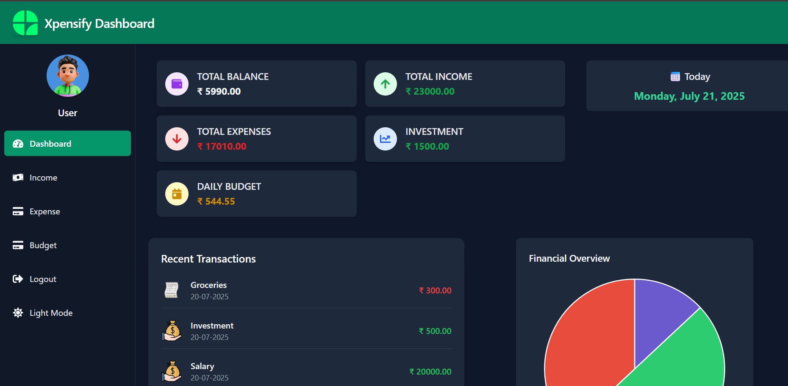
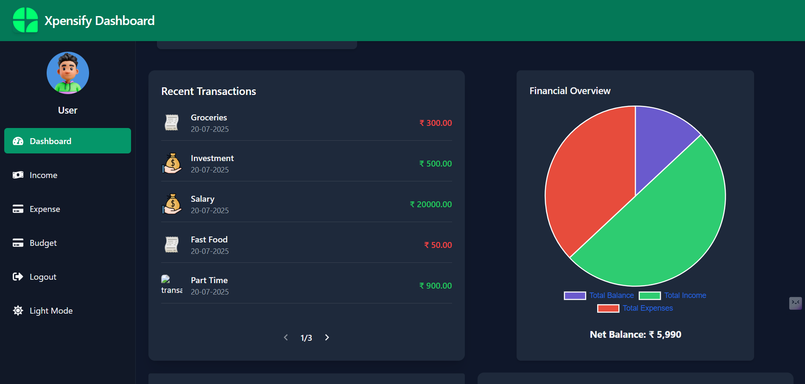
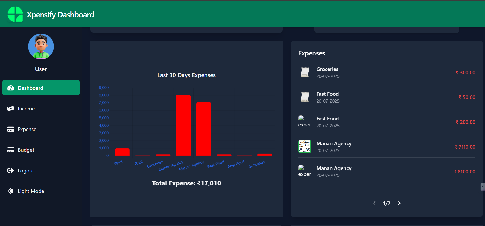
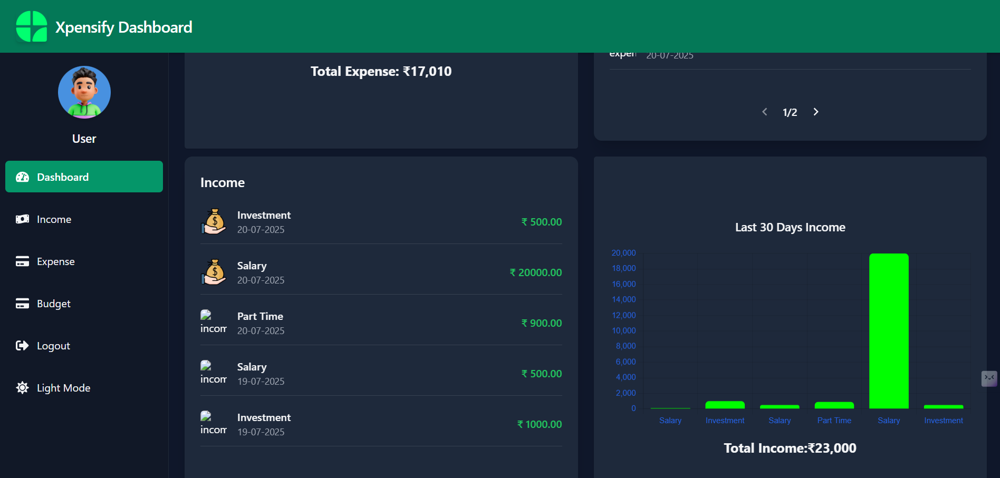

# 💸 Xpensify - Personal Finance Management App

Xpensify is a full-stack web application that helps users efficiently manage their personal finances by tracking **income**, **expenses**, **budgets**, and analyzing financial trends with interactive visualizations.

📹 [Demo Video](https://youtu.be/WMwRtPs4lRc)

[](https://youtu.be/WMwRtPs4lRc)

---

## 🚀 Features

### 🔐 User Authentication
- Register and login using secure JWT-based authentication.
- Multiple user support

### 🔎Pagination
- Efficiently handles large datasets by displaying data in manageable chunks.
- Enhances user experience by enabling quick navigation between pages.

### 💰 Income Tracker
- Add multiple income sources (salary, freelancing, etc.).
- View and manage income history.

### 🧾 Expense Manager
- Add expenses with or without uploading receipts.
- Categorize expenses (e.g., food, travel, shopping).
- Upload PDF/image receipts (POS supported).

### 🎯 Budget Planning
- Set monthly budgets.
- Track budget utilization against expenses.

### 📊 Dashboard Insights
- Monthly income vs expenses overview.
- Financial summaries and spending categories.
- Visualizations with Pie and Bar charts.

### 🔎 Visual Analytics
- Dynamic data filtering and visualizations using Chart.js.
- Search historical income/expenses.

### 🌗 Dark Mode Support
- Toggle between light and dark themes for enhanced user experience.

---

## 🛠 Tech Stack

| Category  | Tech                          |
|-----------|-------------------------------|
| Frontend  | React.js, Tailwind CSS, Axios |
| Backend   | Node.js, Express.js           |
| Database  | MySQL (Remote via Hostinger)  |
| Auth      | JWT Tokens                    |
| Charts    | Chart.js                      |
| Hosting   | Render (Pending) |

---

## 🧾 Receipt Upload Support

- Accepts `.jpg`, `.jpeg`, `.png`, `.pdf` files.
- Files are stored via backend and linked to the related expense record.
- Fallback API available for expense creation without receipt upload.

---
## 📸 Screenshots

| Dashboard  | Dashboard  | Pagination | Dashboard  |
|-------------|-------------|-------------|-------------|
|  |  |  |  |

| Income | Expense| Expense | Daily Budget |
|--------------|--------------|--------------|--------------|
|  |  |  |  |

---
## 📁 Project Structure
```bash
xpensify/
├── backend/
│ ├── routes/
│ ├── controllers/
│ ├── middleware/
│ ├── helper/
│ ├── server.js
│ └── .env
├── frontend/
│ └── src/
│ ├── components/
│ ├── pages/
│ ├── App.js
│ └── constants/index.js
├── screenshots/
│ ├── dashboard.png
│ ├── add-income.png
│ └── receipt.png
└── README.md

```
---

## 📡 API Endpoints

| Method | Endpoint                                 | Description                        |
|--------|------------------------------------------|------------------------------------|
| POST   | `/api/v1/user-registration`              | Register new user                  |
| POST   | `/api/v1/user-login`                     | User login                         |
| POST   | `/api/v1/create-income-source`           | Add income                         |
| GET    | `/api/v1/finance-list`                   | Get income list                    |
| POST   | `/api/v1/create-expences-source`         | Add expense with image             |
| POST   | `/api/v1/create-expences-source-wimage`  | Add expense without image          |
| GET    | `/api/v1/finance-list-expe`              | Get expense list                   |
| GET    | `/api/v1/dashboard-data`                 | Dashboard overview                 |
| GET    | `/api/v1/graph-data`                     | Income/expense graphs              |
| GET    | `/api/v1/budget-list`                    | Fetch budget data                  |
| POST   | `/api/v1/set-budget`                     | Set monthly budget                 |
| GET    | `/api/v1/get-profile`                    | Get profile/budget config          |

---

## 🛠️ Setup Instructions

### 📁 1. Clone the Repository

```bash
git clone https://github.com/your-username/xpensify.git
cd xpensify
```

📦 2. Backend Setup
```bash
cd backend
npm install
```
Create a .env file in the backend/ directory:
```env
DB_HOST=localhost
DB_USER=root
DB_PASSWORD=yourpassword
DB_NAME=yourdatabasename
PORT=2000
```

Start the backend server:
```bash
npm run dev
```

🌐 3. Frontend Setup
```bash
cd ../frontend
npm install
```
Update the API endpoint in frontend/src/constants/index.js:
```bash
export const domain = 'http://localhost:2000'; // or your server IP
export const frontend = 'http://localhost:3000';
```
Start the frontend server:
```bash
npm start
```
## 🧑‍💻 Author
### Pratham Sachan
### 🎓 IIIT Surat – Electronics & Communication Engineering
### 🌐 [LinkedIn](www.linkedin.com/in/prathamsachan8756924) | 📬 [Email](prathamsachan6886@gmail.com)

